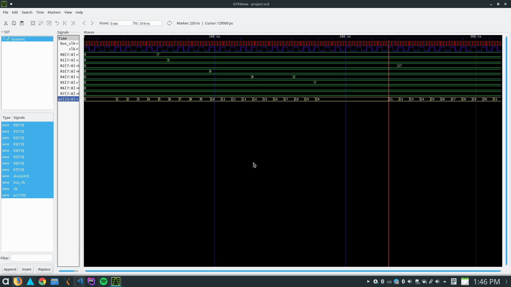

# micro-acc-systemc
> simulating connection of micro processor and accelerator on a bus context with systemc language 

*
*   @ASCK-TEAM
*

## Getting Started
This repository exposed here, is actually a university project of the course `hardware software co-design`

And implemented with `SystemC` language.

- ### Prerequisites
  - #### Installing SystemC
  
    SystemC is a set of C++ classes and macros which provide an event-driven simulation interface.
    
    You can see the ***SystemC installation*** documentation for each one:
    
      - [linux](http://blog.brilacasck.ir/index.php/2018/07/18/how-to-easily-install-system-c-on-ubuntu/){:target="_blank"}
      - mac()
      - windows()
      
  - #### Installing GtkWave
    
    Gtkwave is a software for displaying signals simulation in a wave figure.
    
    You can produce a **.vcd** output file via systemc
    Then you can open it via gtkwave software and watch the simulation.
    
    Download gtkwave in ***Ubuntu*** by using:
    
    <pre> sudo apt install gtkwave </pre>
    
- ### Subject
  - #### Problem
    
    You can figure it out what the project exactly is about here: [project description](./assets/hw-sw_project-description.pdf){:target="_blank"}
    
  - #### Solution
    
    You can see the design, architecture and the datapath of this project here: [project-design](./assets/HWSW-PROJECT-ISA.pdf){:target="_blank"} 
    

## Proof Of Concepts
      
  The datapath of the hardware consists of:
    
  - PC (program counter)
  - IR (instruction memory)
  - IF (instruction fetch phase middle register - for pipelining)
  - RegFile (register file)
  - ID (instruction decode phase middle register - for piplining)
  - ALU (arithmetic/logic unit)
  - EXE (instruction execution phase middle register - for piplining)
  - MEM (share memory between micro and accelerator)
  - WB (instruction write back phase middle register - for piplinig)
  - Mux3 (multiplexer with 3 bits data and 1 bit selector)
  - Mux8 (multiplexer with 8 bits data and 1 bit selector)
    
### <i> Some More Documentation </i>

THIS PROJECT IS ABOUT ARCHITECTING A HARDWARE-SOFTWARE ARCHITECTURE USING SYSTEMC

The version of SystemC which is used in this project is 2.3.1

The hierarchy display of the modules is demonstrated here:

----System

-----------| 

-----------Micro

------------------|

------------------PC         //program counter

------------------IR         //Instruction Memory

------------------IF         //Instruction Fetch Register (for pipeline)

------------------RegFile    //Register File

------------------ID         //Instruction Decode Register (for pipeline)

------------------ALU        //Arithmetic/Logic Unit

------------------Mux3       //Multiplexer 2 inputs with 3 bits

------------------Mux8       //Multiplexer 2 inputs with 8 bits

------------------EXE        //Instruction Execution Register (for pipeline)

------------------WB         //Instruction WriteBack Register (for pipeline) 

-----------Bus

-----------Memory

-----------Acc

----/

> NOTES

***Note that Micro is a micro processor with synch clk which its rate is a quarter of bus-clk***

***Note that the accelerator is a separate component helping the main micro in computing***

***Note that the accelerator works asynchronous so that we need events for using wait/notify***

***Note that the System works with `bus-clk` (clk_bus) which is `faster than` the `micro clk` (clk)***

 

***Note that there is two subfoler in this repository named `instructions` and `test`***

  - test folder : all testbenches for all components (some of these files are empty -> you can fill it yourself)
  - instructions folder: there are files you can see the binary micro-processor instructions you can put them into IR.cpp file.
  
***Note That the main testbench is named main.cpp, tests the System.cpp module***

***Note that some couple of the opselect values for ALU are the same, so we get help from the main opcode and recognize the aluop*** 

***Note that some needed signals like controlling bits and immediate value (also known as offset) are propagated through the middle registers  (IF, ID, EXE, WB)*** 

 

***Note that these modules work with `micro-clk`:***

  - Micro
  - PC
  - IF
  - ID
  - EXE
  - WB
  
***Note that these modules work with `bus-clk`:***

  - Bus
  - System
  
***Note that these modules works with `no clk` at all:***

  - IR
  - Controller
  - Mux3
  - Mux8
  - RegFile
  - ALU
  - MEM
  

***Note that these modules work with `SC_THREAD` simulation:***

  - Micro
  - IF
  - ID
  - EXE
  - WB

## Results

To display the wave form results, you must **compile** the `main.cpp` file via **systemc compilation command**, you can use this [documentation](http://blog.brilacasck.ir/index.php/2018/07/18/how-to-easily-install-system-c-on-ubuntu/){:target="_blank"}

When compilation finished, a .vcd file will be created, named `project.vcd` in the root path of repository.

You can open this file via gtkwave software.

In Ubuntu go to the primary folder in which <i>project.vcd</i> file is created and run this command:

<pre> gtkvawe project.vcd </pre>

A window will be opened by gtkwave. now you need to select SystemC branch in the left sub window. the input and output signals which were declared in main.cpp will be shown beneath the sub window.

You can drag each signal and drop them to the `Signals` sub window for displaying the wave.

If everything goes correct, your output would be like this: 

Don't remember to zoom out the waves sub window! 

## Authors

  - Alireza Kavian ( [@alirezakay](https://github.com/alirezakay){:target="_blank"} )
  - Soheil Changizi ( [@cocolico14](https://github.com/cocolico14){:target="_blank"} )
  
## Org.

  - ***[Brilacasck](https://brilacasck.ir){:target="_blank"}*** 
  
## Team
  
  - ***ASCK TEAM***

## License

This project is licensed under the MIT License - see the [LICENSE](./LICENSE) file for details

