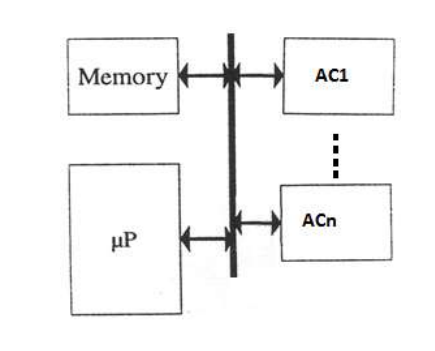

# **🛠️ Repository Under Construction 🛠️**

# micro-acc-systemc
> simulating connection of micro processor and accelerator on a bus context with systemc language 

*
*   @ASCK-TEAM
*

## Getting Started
This repository exposed here, is actually a university project of the course `hardware software co-design`

And implemented with `SystemC` language.

- ### Prerequisites
  - #### Installing SystemC
  
    SystemC is a set of C++ classes and macros which provide an event-driven simulation interface.
    
    You can see the ***SystemC installation*** documentation for each one:
    
      - [linux]()
      - [mac]()
      - [windows]()
      
  - #### Installing GtkWave
    
    Gtkwave is a software for displaying signals simulation in a vawe figure.
    
    You can produce a **.vcd** output file via systemc
    Then you can open it via gtkwave software and watch the simulation.
    
    Download gtkwave in ***Ubuntu*** by using:
    
    <pre> sudo apt install gtkwave </pre>
    
- ### Subject
  - #### Problem
    
    You can figure it out what the project exactly is about here: [project description]()
    
  - #### Solution
    
    You can see the design, architecture and the datapath of this project here: [project-design]() 
    

## Proof Of Concepts
      
  The datapath of the hardware consists of:
    
  - PC (program counter)
  - IR (instruction memory)
  - IF (instruction fetch phase middle register - for pipelining)
  - RegFile (register file)
  - ID (instruction decode phase middle register - for piplining)
  - ALU (arithmetic/logic unit)
  - EXE (instruction execution phase middle register - for piplining)
  - MEM (share memory between micro and accelerator)
  - WB (instruction write back phase middle register - for piplinig)
  - Mux3 (multiplexer with 3 bits data and 1 bit selector)
  - Mux8 (multiplexer with 8 bits data and 1 bit selector)
    
### <i> Some More Documentation </i>

THIS PROJECT IS ABOUT ARCHITECTING A HARDWARE-SOFTWARE ARCHITECTURE USING SYSTEMC

The version of SystemC which is used in this project is 2.3.1

The hierarchy display of the modules is demonstrated here:

----System

-----------| 

-----------Micro

------------------|

------------------PC         //program counter

------------------IR         //Instruction Memory

------------------IF         //Instruction Fetch Register (for pipeline)

------------------RegFile    //Register File

------------------ID         //Instruction Decode Register (for pipeline)

------------------ALU        //Arithmetic/Logic Unit

------------------Mux3       //Multiplexer 2 inputs with 3 bits

------------------Mux8       //Multiplexer 2 inputs with 8 bits

------------------EXE        //Instruction Execution Register (for pipeline)

------------------WB         //Instruction WriteBack Register (for pipeline) 

-----------Bus

-----------Memory

-----------Acc

----/

***Note that Micro is a micro processor with synch clk which its rate is a quarter of bus-clk***

***Note that the accelerator is a separate component helping the main micro in computing***

***Note that the accelerator works asynchronous so that we need events for using wait/notify***

***Note that the System works with bus-clk (clk_bus) which is faster than the micro clk (clk)***

***Note that there is two subfoler in this repository named `instructions` and `test` ***

  - test folder : all testbenchs for all components (some of these files are empty -> you can fill it yourself)
  - instructions folder: there is files you can see binary micro-processor instructions you can put them into IR.cpp file.  

